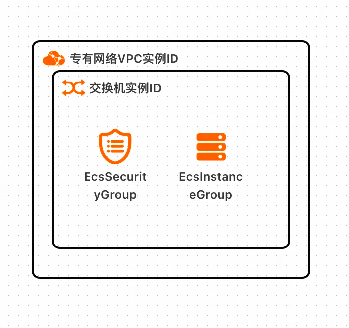
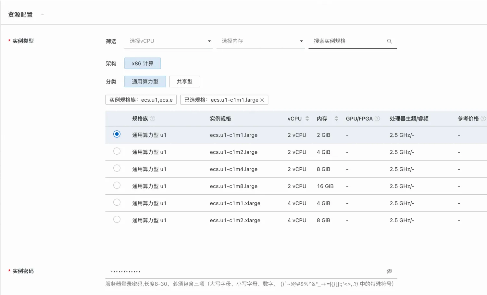
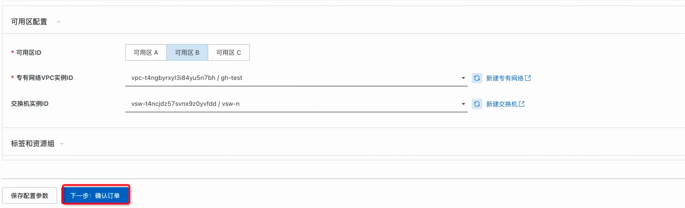
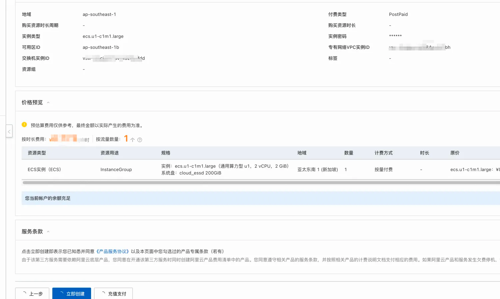
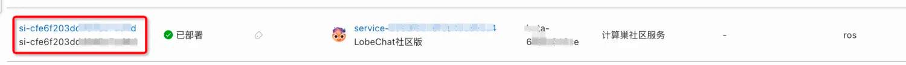
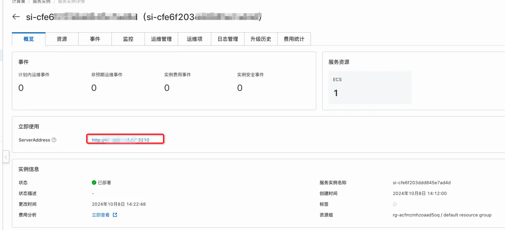
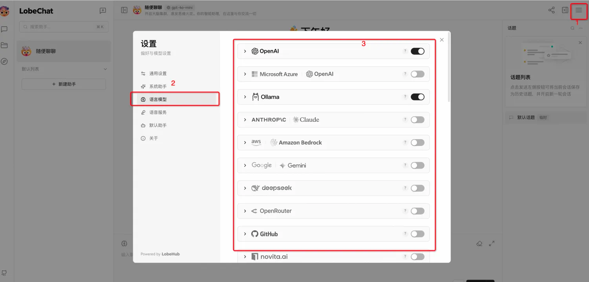

<h1> Rapid deployment of the LobeChat computing nest </h1>

<blockquote>
    
<strong> Disclaimer:</strong> This service is provided by a third party. We try our best to ensure its security,
        accuracy and reliability, but we cannot guarantee that it is completely free from failure, interruption, error
        or attack. Therefore, the company hereby declares that it makes no representations, warranties or commitments
        regarding the content, accuracy, completeness, reliability, suitability and timeliness of the Service and is not
        liable for any direct or indirect loss or damage arising from your use of the Service; for third-party websites,
        applications, products and services that you access through the Service, do not assume any responsibility for
        its content, accuracy, completeness, reliability, applicability and timeliness, and you shall bear the risks and
        responsibilities of the consequences of use; for any loss or damage arising from your use of this service,
        including but not limited to direct loss, indirect loss, loss of profits, loss of goodwill, loss of data or
        other economic losses, even if we have been advised in advance of the possibility of such loss or damage; we
        reserve the right to amend this statement from time to time, so please check this statement regularly before
        using the Service. If you have any questions or concerns about this Statement or the Service, please contact us.
    

</blockquote>

<h2> Overview </h2>

LobeChat is a modern open source ChatGPT/LLMs chat application and development framework  
    It supports speech synthesis, multi-modal, and extensible (<a
            href="https://lobehub.com/zh/blog/openai-function-call">function call</a>) plug-in system. You can use
    LobeChat to have your own ChatGPT/Gemini/Claude/Ollama application for free with one click 

<h2> Prerequisites </h2>

 To deploy a Dify Community Edition service instance, you need to access and
    create some Alibaba Cloud resources. Therefore, your account must contain permissions for the following
    resources.  <strong>
    Description </strong>: 51);">: this permission is required only when your account is a RAM account. 

<table>
<thead>
<tr>
    <th> Permission policy name </th>
    <th> Remarks </th>
    </tr>
    </thead>
    <tbody>
    <tr>
        <td>AliyunECSFullAccess</td>
        <td> Permissions to manage ECS </td>
    </tr>
    <tr>
        <td>AliyunVPCFullAccess</td>
        <td> Permissions to manage a VPC </td>
    </tr>
    <tr>
        <td>AliyunROSFullAccess</td>
        <td> Manage permissions for the Resource Orchestration Service
            (ROS) </td>
    </tr>
    <tr>
        <td>AliyunComputeNestUserFullAccess</td>
        <td> Manage user-side permissions for the compute nest service
            (ComputeNest) </td>
    </tr>
    </tbody>
    </table>

<h2> Billing instructions </h2>

 The cost of LobeChat community edition deployment in computing nest mainly
    involves:

<ul>
    <li> selected vCPU and memory specifications </li>
    <li> System disk type and capacity </li>
    <li> Internet bandwidth </li>
</ul>

<h2> Deployment Architecture </h2>

<h2> Parameter description </h2>

<table>
    <thead>
    <tr>
        <th> parameter group </th>
        <th> parameter items </th>
        <th> Description </th>
    </tr>
    </thead>
    <tbody>
    <tr>
        <td> Service instance </td>
        <td> Service instance name </td>
        <td> No more than 64 characters in length, must start with an English
            letter, and can contain numbers, English letters, dashes (-), and underscores (_)</td>
    </tr>
    <tr>
        <td></td>
        <td> Region </td>
        <td> Region where the service instance is deployed </td>
    </tr>
    <tr>
        <td></td>
        <td> Payment type </td>
        <td> Resource billing type: Pay-As-You-Go and Subscription </td>
    </tr>
    <tr>
        <td>ECS instance configuration </td>
        <td> instance type </td>
        <td> Instance specifications available in the Availability Zone 
        </td>
    </tr>
    <tr>
        <td></td>
        <td> Instance password </td>
        <td> is 8-30 in length and must contain three items (uppercase letters,
            lowercase letters, numbers, ()'~! @#$%^&*-+=<{}[]:;'<>,. special symbols in?/)</td>
    </tr>
    <tr>
        <td> Network Configuration </td>
        <td> Availability Zone </td>
        <td> Zone where the ECS instance is located </td>
    </tr>
    <tr>
        <td></td>
        <td>VPC ID</td>
        <td> VPC where the resource is located </td>
    </tr>
    <tr>
        <td></td>
        <td> Switch ID</td>
        <td> Switch where the resource is located </td>
    </tr>
    </tbody>
</table>

<h2> Deployment process </h2>

<ol>
    <li> visit the compute nest LobeChat<a
            href="https://computenest.console.aliyun.com/service/instance/create/default?type=user&ServiceName=LobeChat%E7%A4%BE%E5%8C%BA%E7%89%88">
        deployment link </a> and fill in the deployment parameters as prompted
    </li>
    <li> Fill in the instance parameters </li>
    <li> Fill in the network parameters and click "Next: Confirm Order" </li>
    <li> Click Create Now and wait for the service instance deployment to complete 
    </li>
    <li> After the service instance is deployed, click the instance ID to go to the details page </li>
    <li> Use the URL to access the service instance </li>
    <li> Go to the LobeChat application interface and configure the API Key</li>
    for the model.
    <li> Get started with LobeChat!</li>
</ol>
